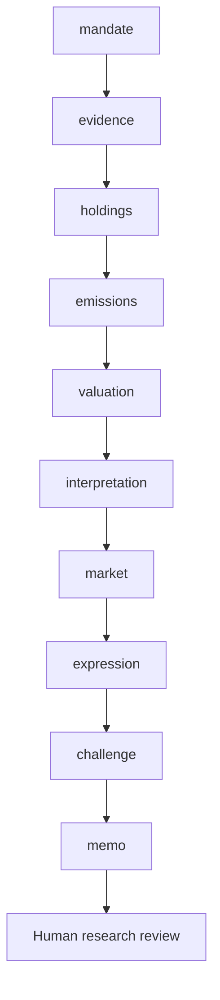

# Workflow

What emissions are financed by the scoped holdings, how complete is the data, and why did the measured inventory change?

Routes: `listed-corporate-inventory`, `period-attribution`, `data-quality-review`. These named use cases share a sequential evidence/review core; they are not separately calibrated financial models.

| Step | Research task | Stage ID |
|---|---|---|
| 1 | Mandate and investable decision | `mandate` |
| 2 | Evidence intake and reconciliation | `evidence` |
| 3 | Holdings, denominators and scope | `holdings` |
| 4 | Emissions and quality controls | `emissions` |
| 5 | Inventory and period attribution | `valuation` |
| 6 | Portfolio interpretation | `interpretation` |
| 7 | Market context and implementation evidence | `market` |
| 8 | Investment-decision handoff | `expression` |
| 9 | Independent challenge and exceptions | `challenge` |
| 10 | Investment committee and accountable review | `memo` |

A COMPLETE artifact is structurally complete, not certified correct. Material gaps stop dependencies. Open MATERIAL/CRITICAL issues block research approval. A source-study intentionally stops after the evidence stage.
